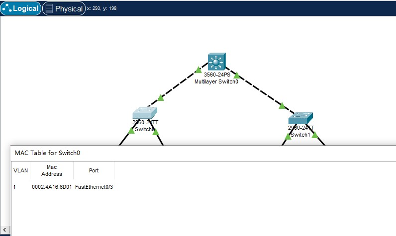
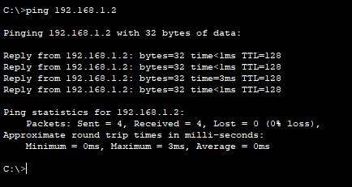

# CiscoPacketTracer实验

- [CiscoPacketTracer实验](#ciscopackettracer实验)
  - [CPT软件使用简介](#cpt软件使用简介)
  - [直接连接两台PC构建LAN](#直接连接两台pc构建lan)
  - [用交换机构建LAN](#用交换机构建lan)
    - [问题](#问题)
    - [试一试](#试一试)
  - [交换机接口地址列表](#交换机接口地址列表)
  - [生成树协议（Spanning Tree Protocol）](#生成树协议spanning-tree-protocol)
  - [路由器配置初步](#路由器配置初步)
    - [问题](#问题-1)
  - [静态路由](#静态路由)
  - [动态路由 RIP](#动态路由-rip)
  - [动态路由OSPF](#动态路由ospf)
  - [基于端口的网络地址翻译 PAT](#基于端口的网络地址翻译-pat)
  - [虚拟局域网VLAN](#虚拟局域网vlan)
  - [虚拟局域网管理VTP](#虚拟局域网管理vtp)
  - [VLAN间的通信](#vlan间的通信)
  - [DHCP、DNS及Web服务器简单配置](#dhcpdns及web服务器简单配置)
    - [试一试](#试一试-1)
  - [WLAN初步配置](#wlan初步配置)

## CPT软件使用简介
> CPT系列视频：
> https://www.bilibili.com/video/av33482059/?vd_source=5ce37ffef8b26b46c0e75ac69418ce70
> CPT实验教程
> https://blog.csdn.net/Al_assad/article/details/70255987
>
> 请使用上面的参考链接,了解和熟悉 CPT 软件的使用。

## 直接连接两台PC构建LAN
> 将两台 PC 直接连接构成一个网络。注意：直接连接需使用交叉线。
> 进行两台 PC 的基本网络配置，只需要配置 IP 地址即可，然后相互 ping 通即成功。

首先设置两台pc并使用交叉线直接相连：

为两台pc设置ip地址：

尝试用PC0(192.168.0.1) `ping` PC1(192.168.0.2)：

成功ping通

尝试用PC1 `ping` PC0：

成功ping通

## 用交换机构建LAN
> 构建如下拓扑结构的局域网：

按照要求构建：

>各PC的基本网络配置如下表：

依次配置好：

### 问题
> 1. PC0 能否 ping 通 PC1、PC2、PC3 ？
> 2. PC3 能否 ping 通 PC0、PC1、PC2 ？为什么？
> 3. 将 4 台 PC 的掩码都改为 255.255.0.0 ，它们相互能 ping 通吗？为什么？
> 4. 使用二层交换机连接的网络需要配置网关吗？为什么？

第一问：

根据模拟结果，PC0可以ping通PC1，但是不能ping通PC2和PC3

第二问：
同样的道理，PC3可以ping通PC2，但是不能ping通PC0和PC1

第三问：

模拟的结果显示，将子网掩码都改为255.255.0.0后相互就可以ping通了，因为此时这些PC都处在了同一子网之下。

第四问：
需要，因为如果这样连接的网络里面的设备不在同一子网就仍是不可联通的，需要有网关的存在才可以连接到子网之外的ip地址。

### 试一试
> 集线器Hub集线器 Hub 是工作在物理层的多接口设备，它与交换机的区别是什么？请在 CPT 软件中用 Hub 构建网络进行实际验证。

回答：集线器与交换机的区别在于以下几点：
1. 在网络中工作的层次不同，集线器在物理层，而交换机则在数据链路层
2. 收发方式不同，集线器是默认广播的设备，而交换机则通过查表，尽量在避免广播
3. 传输模式，集线器的所有节点共用一条总线，不能多线同时工作，而交换机的每条通道都是相互独立的

## 交换机接口地址列表
> 二层交换机是一种即插即用的多接口设备，它对于收到的帧有 3 种处理方式：广播、转发和丢弃（请弄清楚何时进行何种操作）。那么，要转发成功，则交换机中必须要有接口地址列表即 MAC 表，该表是交换机通过学习自动得到的！
> 仍然构建上图的拓扑结构，并配置各计算机的 IP 在同一个一个子网，使用工具栏中的放大镜点击某交换机如左边的 Switch3，选择 `MAC Table`，可以看到最初交换机的 MAC 表是空的，也即它不知道该怎样转发帧（那么它将如何处理？），用 PC0 访问（`ping`）PC1 后，再查看该交换机的 MAC 表，现在有相应的记录，请思考如何得来。随着网络通信的增加，各交换机都将生成自己完整的 MAC 表，此时交换机的交换速度就是最快的！

空白的MAC表：

`ping pC1`之后：

再次查看MAC表：

## 生成树协议（Spanning Tree Protocol）
> 交换机在目的地址未知或接收到广播帧时是要进行广播的。如果交换机之间存在回路/环路，那么就会产生广播循环风暴，从而严重影响网络性能。
> 而交换机中运行的 STP 协议能避免交换机之间发生广播循环风暴。
> 只使用交换机，构建如下拓扑：

> 这是初始时的状态。我们可以看到交换机之间有回路，这会造成广播帧循环传送即形成广播风暴，严重影响网络性能。
> 随后，交换机将自动通过生成树协议（STP）对多余的线路进行自动阻塞（Blocking），以形成一棵以 Switch4 为根（具体哪个是根交换机有相关的策略）的具有唯一路径树即生成树！
> 经过一段时间，随着 STP 协议成功构建了生成树后，Switch5 的两个接口当前物理上是连接的，但逻辑上是不通的，处于Blocking状态（桔色）如下图所示：

> 在网络运行期间，假设某个时候 Switch4 与 Switch5 之间的物理连接出现问题（将 Switch4 与 Switch5 的连线剪掉），则该生成树将自动发生变化。Switch5 上方先前 Blocking 的那个接口现在活动了（绿色），但下方那个接口仍处于 Blocking 状态（桔色）。如下图所示：

## 路由器配置初步
> 我们模拟重庆交通大学和重庆大学两个学校的连接，构建如下拓扑：

(已经为路由器添加上广域网模块WIC-1T)

> 说明一
> 交通大学与重庆大学显然是两个不同的子网。在不同子网间通信需通过路由器。
> 路由器的每个接口下至少是一个子网，图中我们简单的规划了 3 个子网：
> 1. 左边路由器是交通大学的，其下使用交换机连接交通大学的网络，分配网络号 192.168.1.0/24，该路由器接口也是交通大学网络的网关，分配 IP 为 192.168.1.1
> 2. 右边路由器是重庆大学的，其下使用交换机连接重庆大学的网络，分配网络号 192.168.3.0/24，该路由器接口也是重庆大学网络的网关，分配 IP 为 192.168.3.1
> 3. 两个路由器之间使用广域网接口相连，也是一个子网，分配网络号 192.168.2.0/24

给重庆交通大学的路由器设置：

给重庆大学的路由器设置：

> 说明二
> 现实中，交通大学和重庆大学的连接是远程的。该连接要么通过路由器的光纤接口，要么通过广域网接口即所谓的 serial 口（如拓扑图所示）进行，一般不会通过双绞线连接（为什么？）。
>下面我们以通过路由器的广域网口连接为例来进行相关配置。请注意：我们选用的路由器默认没有广域网模块（名称为 WIC-1T 等），需要关闭路由器后添加，然后再开机启动。

回答：双绞线在距离拉长以后信号衰减比较严重，而重庆交通大学和重庆大学的距离很远，需要用到广域网接口。

> 说明三
> 在模拟的广域网连接中需注意 DCE 和 DTE 端（连线时线路上有提示，带一个时钟标志的是 DCE 端。有关 DCE 和 DTE 的概念请查阅相关资料。），在 DCE 端需配置时钟频率 64000

设置时钟频率：

> 说明四
> 路由器有多种命令行配置模式，每种模式对应不同的提示符及相应的权限。
> 请留意在正确的模式下输入配置相关的命令。
> User mode：用户模式
> Privileged mode：特权模式
> Global configuration mode：全局配置模式
> Interface mode：接口配置模式
> Subinterface mode：子接口配置模式

> 说明五
> 在现实中，对新的路由器，显然不能远程进行配置，我们必须在现场通过笔记本的串口与路由器的 console 接口连接并进行初次的配置（注意设置比特率为9600）后，才能通过网络远程进行配置。这也是上图左上画出笔记本连接的用意。

使用笔记本配置比特率：

> 说明六
> 在路由器的 CLI 界面中，可看到路由器刚启动成功后，因为无任何配置，将会提示是否进行对话配置（Would you like to enter the initial configuration dialog?），因其步骤繁多，请选择 NO

初步配置：

> 拓扑图中路由器各接口配置数据如下：

> 拓扑图中各 PC 配置数据如下：

> 交通大学路由器基本配置如下：

> 重庆大学路由器基本配置如下：

上述操作全部完成以后：

整个网络已经联通

### 问题
> 现在交通大学内的各 PC 及网关相互能 ping 通，重庆大学也类似。但不能从交大的 PC ping 通重大的 PC，反之亦然，也即不能跨子网。为什么？

回答：现在的路由器中为空，没有任何保存路由路径，找不到可以通向目标ip的路径。

## 静态路由
> 静态路由是非自适应性路由协议，是由网络管理人员手动配置的，不能够根据网络拓扑的变化而改变。 因此，静态路由简单高效，适用于结构非常简单的网络。
> 在当前这个简单的拓扑结构中我们可以使用静态路由，即直接告诉路由器到某网络该怎么走即可。
> 在前述路由器基本配置成功的情况下使用以下命令进行静态路由协议的配置：

配置交通大学路由器静态路由：

配置重庆大学路由器静态路由：

配置成功以后尝试ping：

可以看到交通大学的PC0成功ping通了重庆大学的PC1

## 动态路由 RIP
> 动态路由协议采用自适应路由算法，能够根据网络拓扑的变化而重新计算机最佳路由。
> RIP 的全称是 Routing Information Protocol，是距离矢量路由的代表（目前虽然淘汰，但可作为我们学习的对象）。使用 RIP 协议只需要告诉路由器直接相连有哪些网络即可，然后 RIP 根据算法自动构建出路由表。
> 因为我们模拟的网络非常简单，因此不能同时使用静态和动态路由，否则看不出效果，所以我们需要把刚才配置的静态路由先清除掉。

> 清楚静态路由配置：
> 1. 直接关闭路由器电源。相当于没有保存任何配置，然后各接口再按照前面基本配置所述重新配置 IP 等参数（推荐此方法，可以再熟悉一下接口的配置命令）；
> 2. 使用 no 命令清除静态路由。在全局配置模式下，交通大学路由器使用：`no ip route 192.168.3.0 255.255.255.0 192.168.2.2`，重庆大学路由器使用：`no ip route 192.168.1.0 255.255.255.0 192.168.2.1` 。相当于使用 no 命令把刚才配置的静态路由命令给取消。

清楚两个路由器的静态路由：

> 配置RIP路由表：

配置：

## 动态路由OSPF
> OSPF（Open Shortest Path First 开放式最短路径优先）是一个内部网关协议（Interior Gateway Protocol，简称 IGP）， 用于在单一自治系统（Autonomous System，AS）内决策路由。OSPF 性能优于 RIP，是当前域内路由广泛使用的路由协议。
> 同样的，我们需要把刚才配置的 RIP 路由先清除掉。

> 清除 RIP 路由配置：
> 直接关闭路由器电源。相当于没有保存任何配置，然后各接口再按照前面基本配置所述重新配置 IP 等参数
> 使用 `no` 命令清除 RIP 路由。在全局配置模式下，各路由器都使用：`no router rip` 命令进行清除

配置路由：

## 基于端口的网络地址翻译 PAT
> 网络地址转换（NAT，Network Address Translation）被各个 Internet 服务商即 ISP 广泛应用于它们的网络中，也包括 WiFi 网络。 原因很简单，NAT 不仅完美地解决了 lP 地址不足的问题，而且还能够有效地避免来自网络外部的攻击，隐藏并保护网络内部的计算机。
> NAT 的实现方式一般有三种：
> 静态转换： Static NAT
> 动态转换： Dynamic NAT
> 端口多路复用： OverLoad
> 端口多路复用使用最多也最灵活。OverLoad 是指不仅改变发向 Internet 数据包的源 IP 地址，同时还改变其源端口，即进行了端口地址转换（PAT，Port Address Translation）。
> 采用端口多路复用方式，内部网络的所有主机均可共享一个合法外部 IP 地址实现对 Internet 的访问，从而可以最大限度地节约IP地址资源。 同时，又可隐藏网络内部的所有主机，有效避免来自 Internet 的攻击。因此，目前网络中应用最多的就是端口多路复用方式。
> 我们仍然使用重庆交通大学和重庆大学两个学校的拓扑进行 PAT 实验。我们需要保证两个学校的路由已经配置成功，无论使用静态路由还是动态路由，以下我们给出完整的配置过程：设定这两个学校的路由器使用 OSPF 协议，模拟交通大学使用内部 IP 地址（192.168.1.0/24），模拟重庆大学使用外部 IP 地址（8.8.8.0/24），两个路由器之间使用外部 IP 地址（202.202.240.0/24），在交通大学的出口位置即广域网口实施 PAT。

> 拓扑图中各 PC 配置数据如下：

更改PC2和PC3配置数据：

> 拓扑图中路由器各接口配置数据如下：

更改路由器配置数据：
1. 更改交通大学广域网口：

2. 更改重庆大学以太网口：

3. 更改重庆大学广域网口：

配置路由器接口：

更改过程：

此时拓扑图已经重新全部联通：

> 设置OSPF路由配置：

设置过程：

> 此时，这些 PC 能全部相互 ping 通！如在交通大学内部使用 PC0（`192.168.1.2`）来 `ping` 重庆大学的PC2（`8.8.8.2`）应该成功。

如图可见，PC2成功ping通了PC0！

## 虚拟局域网VLAN
> 在实际网络中（如我校的网络），你可看到路由器一般位于网络的边界，而内部几乎全部使用交换机连接。
> 前面我们分析过，交换机连接的是同一个子网！ 显然，在这样一个大型规模的子网中进行广播甚至产生广播风暴将严重影响网络性能甚至瘫痪。
> 另外我们也已经知道，其实学校是划分了 N 多个子网的，那么这些交换机连接的就绝不是一个子网！这样矛盾的事情该如何解释呢？我们实际上使用了支持 VLAN 的交换机！而前述的交换机只是普通的 2 层交换机（或者我们把它当作 2 层交换机在使用。
> VLAN（Virtual Local Area Network）即虚拟局域网。通过划分 VLAN，我们可以把一个物理网络划分为多个逻辑网段即多个子网。
> 划分 VLAN 后可以杜绝网络广播风暴，增强网络的安全性，便于进行统一管理等。
> 在 CPT 中构建如下图所示拓扑：

> Cisco 2960 交换机是支持 VLAN 的交换机，共有 24 个 100M 和 2 个 1000M 以太网口。默认所有的接口都在 VLAN 1 中，故此时连接上来的计算机都处于同一 VLAN，可以进行通信。
> 下面我们就该交换机的 24 个 100M 接口分为 3 个部分，划分到 3 个不同的 VLAN 中，id 号分别设为 10、20、30，且设置别名（computer、communication、electronic）以利于区分和管理。

配置过程：

> 至此，在该交换机上我们就分别划分了3个VLAN（不包括缺省的 VLAN 1）
> 各 VLAN 下 PC 的网络配置及连接的交换机接口如下表：

## 虚拟局域网管理VTP
> 前一个实验我们在交换机上进行了 VLAN 的规划和划分。但在实际应用中，我们绝不允许在这些支持VLAN的交换机上进行随意的 VLAN 划分，如此将造成管理混乱！VLAN的划分必须得到统一的规划和管理，这就需要 VTP 协议。
> VTP（VLAN Trunk Protocol）即 VLAN 中继协议。VTP 通过 ISL 帧或 Cisco 私有 DTP 帧（可查阅相关资料了解）保持 VLAN 配置统一性，也被称为虚拟局域网干道协议，它是思科私有协议。 VTP 统一管理、增加、删除、调整VLAN，自动地将信息向网络中其它的交换机广播。
> 此外，VTP 减小了那些可能导致安全问题的配置，只要在 VTP Server 做相应设置，VTP Client 会自动学习 VTP Server 上的 VLAN 信息。
> 为演示 VTP，重新构建如下拓扑结构：

> 目前该网络都属于 `VLAN 1`，也即这些 PC 是可以相互通信的。前面说过，无论对于性能、管理还是安全等而言，现实中我们必须进行 VLAN 划分。
> 现在我们的要求是：新建两个 VLAN，然后让 PC0 和 PC1 属于 `VLAN 2`，PC1 和 PC3 属于 `VLAN 3`。
> 我们将在核心交换机 3560上进行如下工作：
> 1. 设置为 `server` 模式，VTP 域为 `cqjtu`
> 2. 新建 `VLAN 2`，网络号 `192.168.1.0/24`，网关 `192.168.1.1`
> 3. 新建 `VLAN 3`，网络号 `192.168.2.0/24`，网关 `192.168.2.1`

配置过程：

> 我们将在左边交换机 2960A 上进行如下工作：
> 1. 加入名为 `cqjtu` 的 VTP 域
> 2. 配置与核心交换机 3560 连接的千兆接口 `g0/1` 为 `trunk` 模式
> 3. 将接口 `f0/1` 划分到 `VLAN 2` 中
> 4. 将接口 `f0/2` 划分到 `VLAN 3` 中

配置过程：

> 我们将在右边交换机 2960B 上进行同样的工作：
> 1. 加入名为 `cqjtu` VTP 域
> 2. 配置与核心交换机 3560 连接的千兆接口 `g0/1` 为 `trunk` 模式
> 3. 将接口 `f0/1` 划分到 `VLAN 2` 中
> 4. 将接口 `f0/2` 划分到 `VLAN 3` 中

配置过程：

> 各 PC 连接的交换机和接口以及网络配置如下：

## VLAN间的通信
> VTP 只是给我们划分和管理 VLAN 提供了方便，由上面的测试得知，目前我们仍然不能在 VLAN 间通信。
> 因为默认的，VLAN 间是不允许进行通信，此时我们需要所谓的独臂路由器在 VLAN 间为其进行转发！
> 我们使用的核心交换机 3560 是个 3 层交换机，可工作在网络层，也称路由交换机，即具有路由功能，能进行这种转发操作。

配置过程：

## DHCP、DNS及Web服务器简单配置
> 动态主机配置 DHCP、域名解析 DNS 以及 Web 服务在日常应用中作用巨大，我们构建如下简单的拓扑来进行练习。

> 该拓扑中，服务器及客户机都连在同一交换机上。为简单起见，服务器 Server-PT 同时作为 DHCP、DNS 以及 Web 服务器，各客户机无需配置，将自动获取网络配置。
> 点击 CPT 拓扑图中的 Server 图标，设置其静态 IP 地址为 `19.89.6.4/24`，然后选择 `Service` 进行如下相关配置：

配置过程：

### 试一试
1. 查看各 PC，看看是否获得网络配置

可以看到PC使用DHCP服务自动获得了ip地址

2. 因为我们在 DNS 服务器中把谷歌和百度的 IP 都设为了 `19.89.6.4`，即 Server-PT，所以，如果打开 PC0 的浏览器，输入 `www.google.com` 或者 `www.baidu.com`，我们都应该看到默认的 Server-PT 这个 Web 服务器的主页（你也可进行编辑）

效果如下图：

## WLAN初步配置
> WLAN即WiFi当前也是广泛地应用在各种场景
> 我们通过构建如下拓扑的一个家庭 WLAN 来练习一下其相关的配置：

