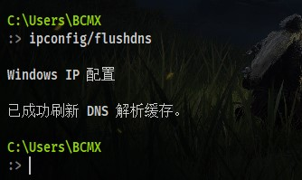
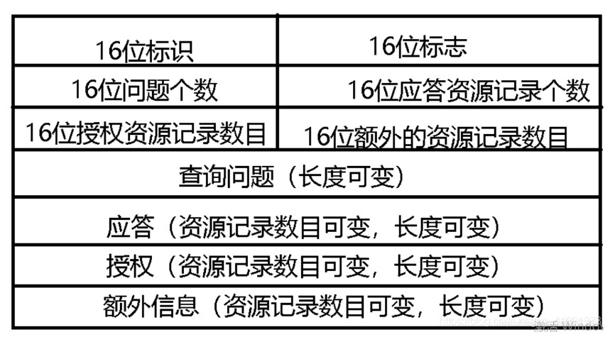
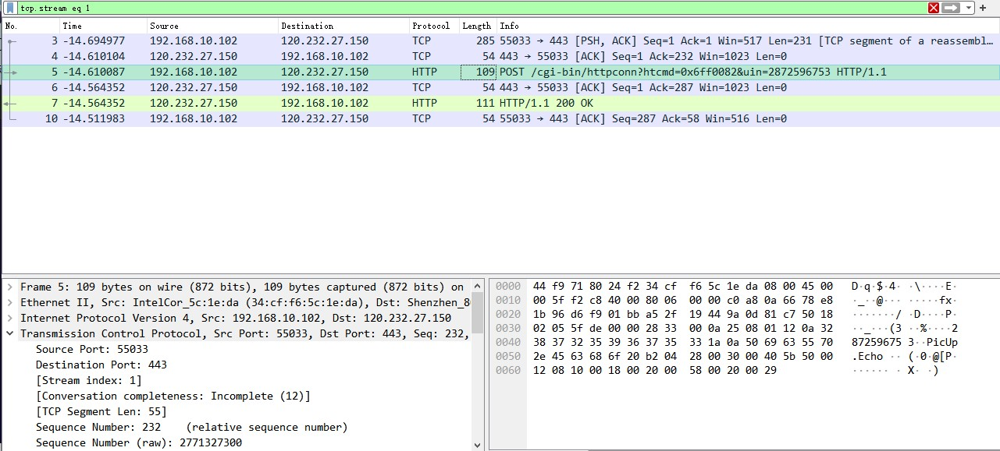
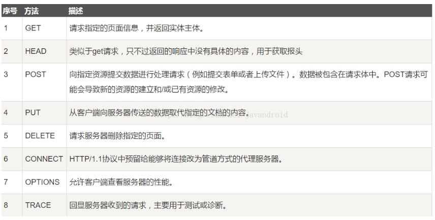

# Wireshark实验 {ignore=true}

- [Wireshark实验 {ignore=true}](#wireshark实验-ignoretrue)
  - [准备](#准备)
  - [数据链路层](#数据链路层)
    - [实作一 熟悉 Ethernet 帧结构](#实作一-熟悉-ethernet-帧结构)
      - [问题](#问题)
    - [实作二 了解子网内/外通信时的 MAC 地址](#实作二-了解子网内外通信时的-mac-地址)
      - [问题](#问题-1)
    - [实作三 掌握 ARP 解析过程](#实作三-掌握-arp-解析过程)
      - [问题](#问题-2)
  - [网络层](#网络层)
    - [实作一 熟悉IP包结构](#实作一-熟悉ip包结构)
      - [问题](#问题-3)
    - [实作二 IP包的分段与重组](#实作二-ip包的分段与重组)
      - [问题](#问题-4)
    - [实作三 考察TTL事件](#实作三-考察ttl事件)
      - [问题](#问题-5)
  - [传输层](#传输层)
    - [实作一 熟悉TCP和UDP段结构](#实作一-熟悉tcp和udp段结构)
      - [问题](#问题-6)
    - [实作二 分析TCP 建立和释放连接](#实作二-分析tcp-建立和释放连接)
      - [问题一](#问题一)
      - [问题二](#问题二)
  - [应用层](#应用层)
    - [实作一 了解DNS解析](#实作一-了解dns解析)
      - [问题](#问题-7)
    - [实作二 了解HTTP的请求和应答](#实作二-了解http的请求和应答)
      - [问题](#问题-8)

## 准备
请自行寻找或使用如下参考资料，了解`Wireshark`的基本使用：

1. 选择对哪块网卡进行数据包捕获
2. 开始/停止捕获
3. 了解 `Wireshark` 主要窗口区域
4. 设置数据包的过滤
5. 跟踪数据流

## 数据链路层

### 实作一 熟悉 Ethernet 帧结构
抓包操作：

Ethernet帧结构：
7B前导码+1B帧前定界符+6B目的地址+6B源地址+2B类型字段+46~1500B数据字段+4B校验码

由图中可以看到帧的目的MAC为`44:f9:71:80:24:f2`,源MAC为`34:cf:f6:5c:1e:da`,类型为IPv4

#### 问题
> 你会发现 Wireshark 展现给我们的帧中没有校验字段，请了解一下原因。

回答：因为校验一般情况下会交给网卡来计算，之后wireshark才可以抓到包，因此wireshark中的校验码是默认过滤掉的。

### 实作二 了解子网内/外通信时的 MAC 地址
> 1. `ping` 你旁边的计算机（同一子网），同时用 Wireshark 抓这些包（可使用 icmp 关键字进行过滤以利于分析），记录一下发出帧的目的 MAC 地址以及返回帧的源 MAC 地址是多少？这个 MAC 地址是谁的？
> 2. 然后 `ping qige.io` （或者本子网外的主机都可以），同时用 Wireshark 抓这些包（可 icmp 过滤），记录一下发出帧的目的 MAC 地址以及返回帧的源 MAC 地址是多少？这个 MAC 地址是谁的？
> 3. 再次 `ping www.cqjtu.edu.cn` （或者本子网外的主机都可以），同时用 Wireshark 抓这些包（可 icmp 过滤），记录一下发出帧的目的 MAC 地址以及返回帧的源 MAC 地址又是多少？这个 MAC 地址又是谁的？

1. 抓旁边计算机的包：

可以看到源MAC地址为`4c:02:20:69:1b:37`，目标MAC地址则为`34:cf:f6:5c:1e:da`，因此可以直到发出帧的目的MAC地址以及返回帧的源MAC地址都为对方计算机的MAC地址

2. 抓`ping qige.io`的包

可以看到发出帧的目的MAC地址以及返回帧的源MAC地址都为`44:f9:71:80:24:f2`，与本机的MAC地址不一致，得知这是本机的默认网关的MAC地址。

3. 抓`www.cqjtu.edu.cn`的包

易得发出帧的目的 MAC 地址以及返回帧的源 MAC 地址都为`44:f9:71:80:24:f2`，仍然是本机默认网关的地址。

#### 问题
> 通过以上的实验，你会发现：
> 1. 访问本子网的计算机时，目的 MAC 就是该主机的
> 2. 访问非本子网的计算机时，目的 MAC 是网关的
> 请问原因是什么？

回答：因为当访问本子网的计算机时，不需要经过任何其他节点就可以访问到，因此目的MAC地址直接指向该计算机。
而当访问非本子网的计算机时就需要先通过网关，因此帧的下一个目的就是网关，因此目的MAC地址是网关的目的地址。

### 实作三 掌握 ARP 解析过程
> 1. 为防止干扰，先使用 arp -d * 命令清空 arp 缓存
> 2. ping 你旁边的计算机（同一子网），同时用 Wireshark 抓这些包（可 arp 过滤），查看 ARP 请求的格式以及请求的内容，注意观察该请求的目的 MAC 地址是什么。再查看一下该请求的回应，注意观察该回应的源 MAC 和目的 MAC 地址是什么。
> 3. 再次使用 arp -d * 命令清空 arp 缓存
> 4. 然后 ping qige.io （或者本子网外的主机都可以），同时用 Wireshark 抓这些包（可 arp 过滤）。查看这次 ARP 请求的是什么，注意观察该请求是谁在回应。

1. `arp -d *`清空arp缓存

2. ping旁边的计算机并抓包

可以看到arp请求为`Who has 192.168.10.101? Tell 192.168.10.102`，且该请求的目的MAC地址为`4c:02:20:69:1b:37`，为ping的ip地址`192.168.10.101`的MAC地址。
而该arp请求的回应为`192.168.10.101 is at 4c:02:20:69:1b:37`，而该回应的源MAC地址为`4c:02:20:69:1b:37`，是目标ip的MAC地址；目的MAC地址为`34:cf:f6:5c:1e:da`，为自身计算机的MAC地址。

3. 再次清空arp缓存

4. ping qige.io并抓包

可以看到arp请求为`Who has 192.168.10.1? Tell 192.168.10.102`，且该请求的目的MAC地址为`44:f9:71:80:24:f2`，是本机默认网关`192.168.10.1`的MAC地址。
而该arp请求的回应为`192.168.10.1 is at 44:f9:71:80:24:f2`，而该回应的源MAC地址为`44:f9:71:80:24:f2`，是默认网关的MAC地址；目的MAC地址为`34:cf:f6:5c:1e:da`，为自身计算机的MAC地址。

#### 问题
> 通过以上的实验，你应该会发现，
> 1. ARP 请求都是使用广播方式发送的
> 2. 如果访问的是本子网的 IP，那么 ARP 解析将直接得到该 IP 对应的 MAC；如果访问的非本子网的 IP， 那么 ARP 解析将得到网关的 MAC
>
> 请问为什么？

回答：因为当访问本子网的计算机时，不需要经过任何其他节点就可以访问到，因此目的MAC地址直接指向该ip对应的MAC地址。
而当访问非本子网的计算机时，ARP代理是通过路由器访问的，而第一个节点总是默认网关，因此解析后会得到网关的MAC地址。

## 网络层

### 实作一 熟悉IP包结构
> 使用 Wireshark 任意进行抓包（可用 ip 过滤），熟悉 IP 包的结构，如：版本、头部长度、总长度、TTL、协议类型等字段。

ip抓包:

ip包的结构如下：

结构中各项如下：
1. 版本：0100表示IPv4，0110则表示IPv6
2. 首部长度：4bit，IP包头的长度
3. 优先级与服务类型：前4个bit代表优先级，中间3个bit代表服务类型，最后1个bit未启用
4. 总长度：16bit，表示IP包的长度
5. TTL：8bit，生存时间，每经过一个路由器减1，减为0时被当前路由器丢弃
6. 协议类型：8bit，标识上层所使用的协议

#### 问题
> 为提高效率，我们应该让 IP 的头部尽可能的精简。但在如此珍贵的 IP 头部你会发现既有头部长度字段，也有总长度字段。请问为什么？

回答：方便直接识别总长度，如果ip包过于长的话需要进行分段。

### 实作二 IP包的分段与重组
> 根据规定，一个 IP 包最大可以有 64K 字节。但由于 Ethernet 帧的限制，当 IP 包的数据超过 1500 字节时就会被发送方的数据链路层分段，然后在接收方的网络层重组。
> 缺省的，`ping` 命令只会向对方发送 32 个字节的数据。我们可以使用 `ping 202.202.240.16 -l 2000` 命令指定要发送的数据长度。此时使用 Wireshark 抓包（用 `ip.addr == 202.202.240.16` 进行过滤），了解 IP 包如何进行分段，如：分段标志、偏移量以及每个包的大小等

`ping 202.202.240.16 -l 2000`指令：

抓包：

可以明显看到2000长度的ip包被分成了一个总长度为1500的包和一个长度为548的包。

分段标志有3bit，第一位保留，第二位为0表示数据包被分片，为1表示未分片，第三位为0表示自己是已经被分片的包中的最后一个，为1则表示不是。
而第一个包的分段标志为001，第二个包的分段标志为000，表示这两个包都被分片过，且第二个包为被分片的包的末尾那个。

段偏移量有13bit，表示该片在原分组中的相对位置
第二个包的段偏移量为1480，代表第二个ip包在未被分片的原包中接在1480这个位置。

#### 问题
> 分段与重组是一个耗费资源的操作，特别是当分段由传送路径上的节点即路由器来完成的时候，所以 IPv6 已经不允许分段了。那么 IPv6 中，如果路由器遇到了一个大数据包该怎么办？

回答：在IPv4的网络中分段由路由器完成，但在IPv6中是在发送的同时就已经分片完成了，发出去的ip包不会过大。而如果IPv6的路由器真的遇到了大数据包，将其丢弃即可。

### 实作三 考察TTL事件
> 在 IP 包头中有一个 TTL 字段用来限定该包可以在 Internet上传输多少跳（hops），一般该值设置为 64、128等。
> 在验证性实验部分我们使用了 `tracert` 命令进行路由追踪。其原理是主动设置 IP 包的 TTL 值，从 1 开始逐渐增加，直至到达最终目的主机。
> 请使用 `tracert www.baidu.com` 命令进行追踪，此时使用 Wireshark 抓包（用 icmp 过滤），分析每个发送包的 TTL 是如何进行改变的，从而理解路由追踪原理。

`tracert www.baidu.com`指令：

抓包：
第一跳的包：

可以看到此时的TTL为1

第七跳的包：

可以看到此时的TTL已经变成了7

#### 问题
> 在 IPv4 中，TTL 虽然定义为生命期即 Time To Live，但现实中我们都以跳数/节点数进行设置。如果你收到一个包，其 TTL 的值为 50，那么可以推断这个包从源点到你之间有多少跳？

回答：TTL一般为64或者128，所以减去剩余的TTL=50以后，这个包从源点到我之间最有可能有14或者78跳。

## 传输层

### 实作一 熟悉TCP和UDP段结构
> 1. 用 Wireshark 任意抓包（可用 tcp 过滤），熟悉 TCP 段的结构，如：源端口、目的端口、序列号、确认号、各种标志位等字段。
> 2. 用 Wireshark 任意抓包（可用 udp 过滤），熟悉 UDP 段的结构，如：源端口、目的端口、长度等。

1. 抓包TCP

如图就已经抓到了一个包并显示其TCP段
TCP段的大致结构如下：

1. 抓包UDP

如图就已经抓到了一个包并显示其UDP段，UDP段的大致结构部如下：

#### 问题
> 由上大家可以看到 UDP 的头部比 TCP 简单得多，但两者都有源和目的端口号。请问源和目的端口号用来干什么？

回答：两者的源和目的端口的用处类似
源端口包含发送数据包的程序所使用的端口，接收端可以根据源端口填写响应的目的端口。
而目的端口则是希望对方使用哪个端口来接收发送的数据包

### 实作二 分析TCP 建立和释放连接
> 1. 打开浏览器访问 qige.io 网站，用 Wireshark 抓包（可用 tcp 过滤后再使用加上 Follow TCP Stream），不要立即停止 Wireshark 捕获，待页面显示完毕后再多等一段时间使得能够捕获释放连接的包。
> 2. 请在你捕获的包中找到三次握手建立连接的包，并说明为何它们是用于建立连接的，有什么特征。
> 3. 请在你捕获的包中找到四次挥手释放连接的包，并说明为何它们是用于释放连接的，有什么特征。

三次握手：

第一次握手:客户端发送的TCP报文中以`SYN`作为标志位，并且客户端序号`Seq=0`；
第二次握手:服务器返回的TCP报文中以`[SYN，ACK]`作为标志位；并且服务器端序号`Seq=0`；确认号`Ack=1`
第三次握手:客户端再向服务器端发送的TCP报文中以`[ACK]`作为标志位；其中客户端序号`Seq=1`，确认号`Ack=1`

四次挥手：

第一次挥手：客户端发送的FIN请求释放连接报文
第二次挥手：服务器收到客户端的结束信号后，发出ACK应答报文
第三次挥手：服务器也准备断开连接时，向客户端发送FIN报文
第四次挥手：客户端发送ACK报文确定断开连接

#### 问题一
> 去掉 `Follow TCP Stream`，即不跟踪一个 TCP 流，你可能会看到访问 `qige.io` 时我们建立的连接有多个。请思考为什么会有多个连接？作用是什么？

回答：这样建立多个连接可以使得浏览器在访问qige.io的时候，运用多个端口同时与qige.io建立连接，同时加载数据，提高速度。

#### 问题二
> 我们上面提到了释放连接需要四次挥手，有时你可能会抓到只有三次挥手。原因是什么？

回答：这种情况便已经发生在了上文，我们的四次挥手只抓到了三次，这是因为当客户端发送FIN报文请求时，服务器的数据已经传输完毕，这时服务器便可以直接准备关闭连接不需要延迟FIN报文的发送来确保数据发送完毕。因此这种情况服务器将第二次和第三次挥手合在一起，可以看到上文的截图中的第二次挥手同时具有标志位ACK和FIN。

## 应用层
> 应用层的协议非常的多，我们只对 DNS 和 HTTP 进行相关的分析。

### 实作一 了解DNS解析
> 1. 先使用 `ipconfig /flushdns` 命令清除缓存，再使用 `nslookup qige.io` 命令进行解析，同时用 Wireshark 任意抓包（可用 dns 过滤）。
> 2. 你应该可以看到当前计算机使用 UDP，向默认的 DNS 服务器的 53 号端口发出了查询请求，而 DNS 服务器的 53 号端口返回了结果。
> 1. 可了解一下 DNS 查询和应答的相关字段的含义

1. 抓包
`ipconfig /flushdns`命令：

`nslookup qige.io` 命令：

抓包：

DNS查询和应答的相关字段:

#### 问题
> 你可能会发现对同一个站点，我们发出的 DNS 解析请求不止一个，思考一下是什么原因？

回答：某些域名不止有一个ip地址，需要多次DNS解析。

### 实作二 了解HTTP的请求和应答
> 1. 打开浏览器访问 qige.io 网站，用 Wireshark 抓包（可用http 过滤再加上 Follow TCP Stream），不要立即停止 Wireshark 捕获，待页面显示完毕后再多等一段时间以将释放连接的包捕获。
> 2. 请在你捕获的包中找到 HTTP 请求包，查看请求使用的什么命令，如：GET, POST。并仔细了解请求的头部有哪些字段及其意义。
> 3. 请在你捕获的包中找到 HTTP 应答包，查看应答的代码是什么，如：200, 304, 404 等。并仔细了解应答的头部有哪些字段及其意义。

http过滤加上Follow TCP Stream：

由图可知捕获的包中主要使用了POST请求。
别的请求方法大致如下：

由图可得捕获的包的主要回应为200。
其他的回应大致如下：
200：表明请求已经成功. 默认情况下状态码为200的响应可以被缓存
304：未改变说明无需再次传输请求的内容，也就是说可以使用缓存的内容。
404：未能找到所请求的资源
405：服务器禁止了当前的请求
406：客户端错误，与服务器端无法进行匹配

#### 问题
> 刷新一次 qige.io 网站的页面同时进行抓包，你会发现不少的 `304` 代码的应答，这是所请求的对象没有更改的意思，让浏览器使用本地缓存的内容即可。那么服务器为什么会回答 `304` 应答而不是常见的 `200` 应答？

回答：304表示缓存中已经存在请求的资源，不需要再次从服务器端获取资源，而200是成功获取到资源以后才做出的回应。