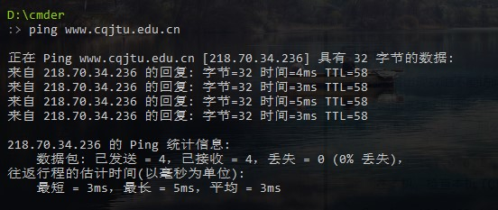
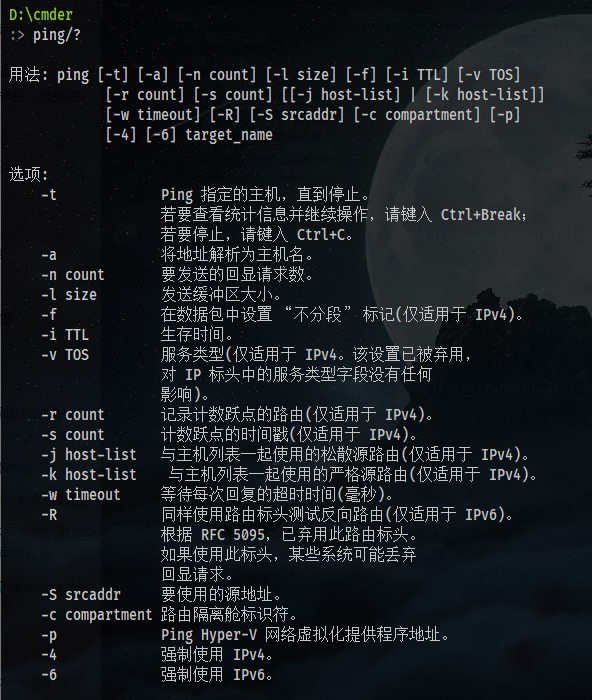
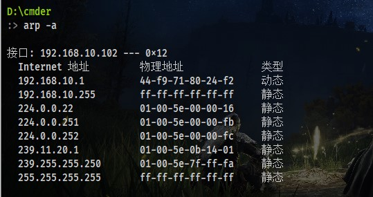
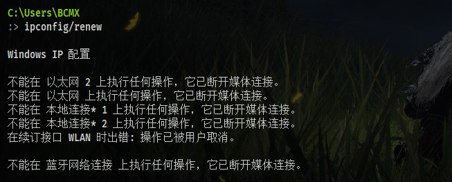
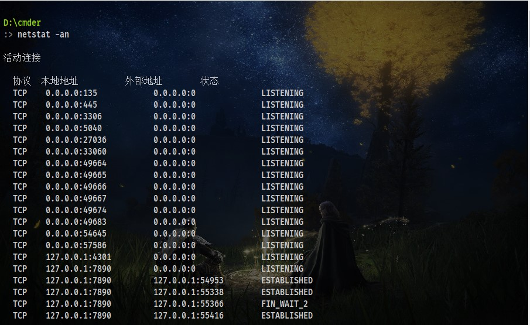
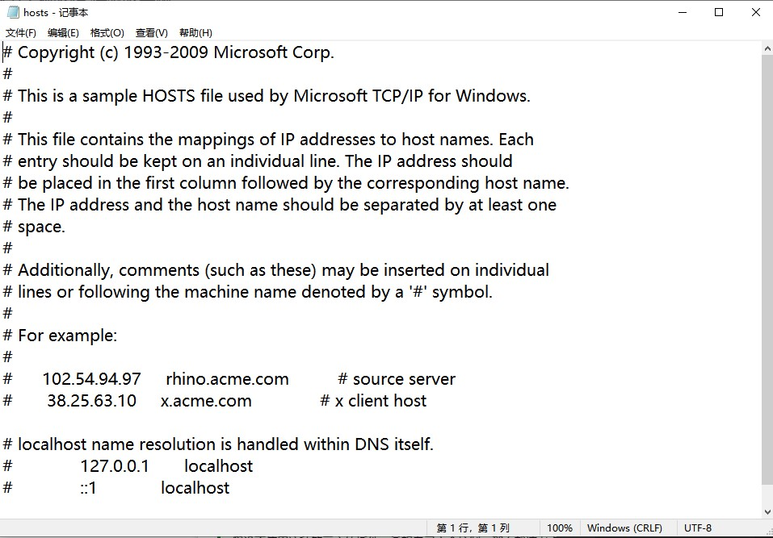
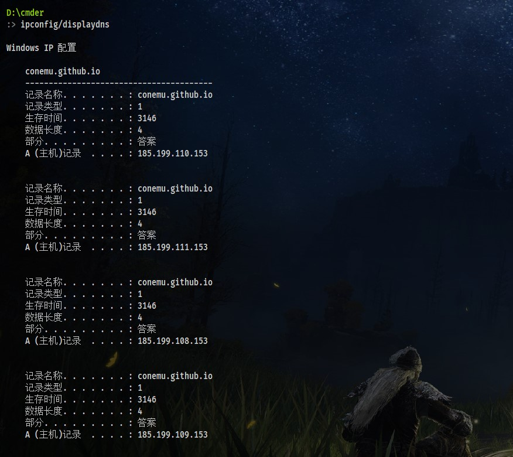
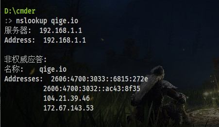
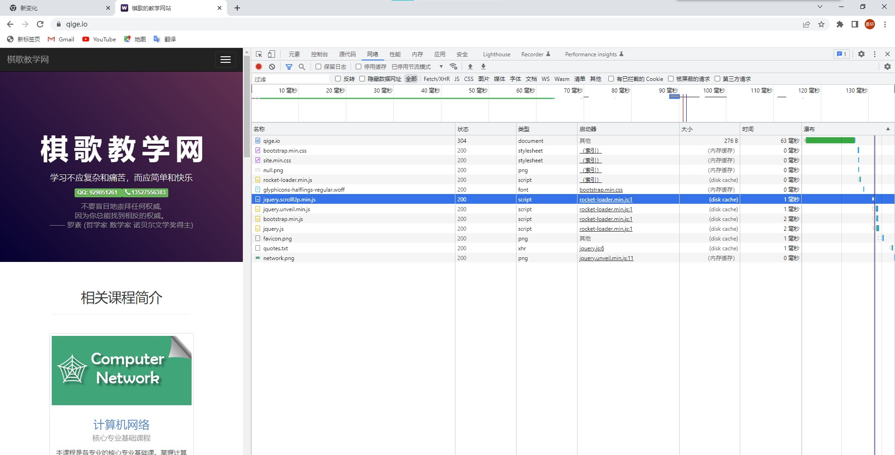
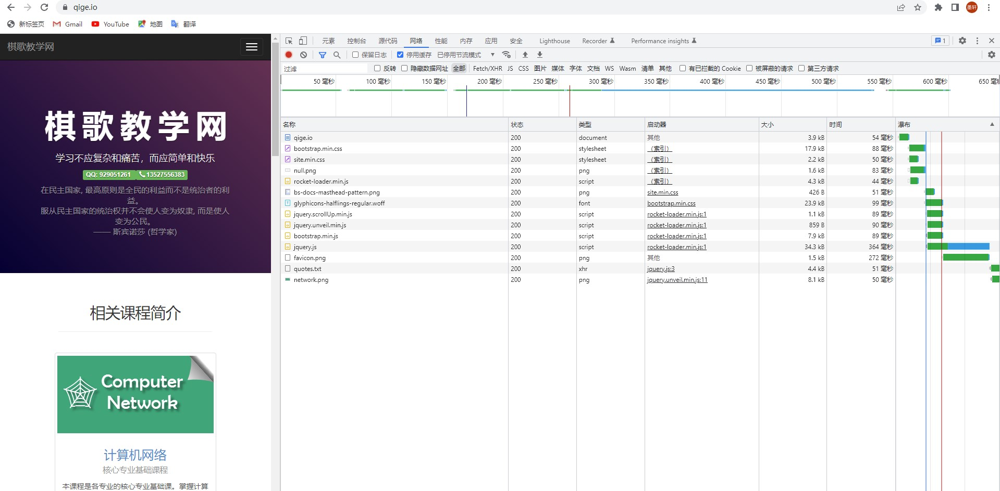

# 验证性实验
***
## ipconfig
`ipconfig`是微软操作系统的计算机上用来控制网络连接的一个命令行工具。它的主要用来显示当前网络连接的配置信息（`/all`参数）。
#### 实作一
> 使用 `ipconfig/all` 查看自己计算机的网络配置，尽可能明白每行的意思，特别注意 IP 地址、子网掩码 Subnet Mask、网关 Gateway。

在本机Cmder程序中输入`ipconfig/all`后结果如下图所示：

可以看到使用`ipconfig/all`指令之后出现了三种ip配置：
1. Windows IP配置
这一条用来展示Windows主机的基本情况：
    1. 主机名：计算机的名字，你的主机在别的设备看来的代号。
    2. 主DNS后缀：默认是没有的，也就是本地解析；如果此项不为空时，是会在主机名后自动添加此项所指定的后缀，这时就会通过DNS服务器来解析。
    3. 节点类型：网络设备上的接口可设为access接入，trunk中继，hybrid混合三种类型，接口设为哪一种类型取决于相应接口的用途，access用于直接接入网络终端，trunk用于网络设备之间级联，hybrid同时具备前面两种类型的特性。
    4. IP路由已启用：这条信息代表Windows的IP转发功能默认关闭，如果将其开启，则这个PC具备路由转发功能。
    5. WINS代理已启用：Windows Internet Name Service（WINS），和DNS一样，都是主机名到网络地址的中央映射。
2. 以太网适配器
适配器即网卡，电脑里一般有两个网卡，**以太网适配器**（有线网卡）和**无线局域网适配器**（wifi网卡），可以看到使用`ipconfig/all`命令后显示出了两项以太网适配器：以太网、蓝牙网络连接，分别用来进行有线网络的连接和蓝牙网络的启用。
本机在进行本次实验是使用重庆交通大学校园网宽带进行，因此主要的ip信息就将显示在以太网连接的部分：

    1. 特定的DNS后缀：用于特定设备的DNS后缀，作用同主DNS后缀
    2. 描述：设备名称
    3. 物理地址：MAC地址，用来确认网络设备位置的位址
    4. DHCP已启用：动态主机配置协议（Dynamic Host Configuration Protocol），是一个局域网的网络协议，使用UDP协议工作。主要有两个用途：给内部网络或网络服务供应商自动分配IP地址，给用户或者内部网络管理员作为对所有计算机作中央管理的手段。
    DHCP已开启就是指客户机固定IP地址从DHCP服务器上取得一个暂时提供给这台机器使用的IP地址。在DHCP服务器上为这些IP地址指定了子网掩码、DNS、网关等信息。
    5. 自动配置已启用：该项所表示基本“同DHCP已启用”
    6. 本地链接IPV6地址：现行版本IP协议（IPV4）的下一代IP协议，目前处于测试阶段
    7. **IPV4地址**：网际协议版本4，目前广泛部署和使用的IP协议，无论你是使用智能手机上网还是使用PC机上网，你的手机或PC机都会被分配一个IP地址，手机或PC机使用这个IP地址与互联网上的其它网络通信并进行信息交换。
    8. **子网掩码**：子网掩码（Subnet Mask）用来指明一个IP地址的哪些位标识的是主机所在的子网，以及哪些位标识的是主机的位掩码。子网掩码不能单独存在，它必须结合IP地址一起使用。
    子网掩码是一个32位地址，用于屏蔽IP地址的一部分以区别网络标识和主机标识，并说明该IP地址是在局域网上，还是在广域网上。其对应网络地址的所有位都置为1，对应于主机地址的所有位置都为0。子网掩码告知路由器，地址的哪一部分是网络地址，哪一部分是主机地址，使路由器正确判断任意IP地址是否是本网段的，从而正确地进行路由。
    9. 获得租约的时间：此ip地址的开始使用时间
    10. 租约过期的时间：此ip地址的到期时间
    11. **默认网关**（Gateway）：网关可以理解为一个网络节点，它负责不同 网络地址 (aka. 网段) 之间的通信。当一台计算机需要和另一台计算机通讯时，计算机需要根据 本机子网掩码和目标IP地址 计算出目标IP所在的网段，然后再根据 本机IP 和 本机的子网掩码 得出本机所在的网段。如果两个网段相同，那么两台计算机是局域网，然后则开始通信；如果不同，也就意味着目标IP是一个远程地址，这时候本机会把数据发送给默认网关，然后默认网关处理接下来的通信。
    12. DHCP服务器：自动为计算机分配IP地址和子网掩码的服务器。
    13. DHCPv6 IAID：身份关联标识符 (Identity Association Identifier, IAID)。
    14. DHCPv6 客户端 DUID：DHCP 唯一标识符 (DHCP Unique Identifier, DUID)。
    15. DNS服务器：域名解析服务器的地址，将网址翻译成IP地址。
    16. TCPIP上的NetBIOS：当安装TCP/IP协 议时，NetBIOS 也被Windows作为默认设置载入，我们的计算机也具有了NetBIOS本身的开放性。

    以上是在使用宽带上网情况下”以太网适配器 以太网“一项所展示的内容，而没有在使用中的项如同样是以太网适配器类的蓝牙网络连接则如下所示：

    1. 媒体状态：当前该设备是否接入网络

    其余项则与上文以太网连接部分相同，不再赘述。
3. 无线局域网适配器
该名词的概念上文已有解释，而本机中的无线局域网分为两个本地连接和一个WLAN连接。WLAN连接用于连接附近的wifi，两个本地连接可以负责提供移动热点等功能。
这些无线局域网适配器分类下的各项参数也已经在上文有所解释，这里不再赘述。

#### 实作二
> 使用 `ipconfig/all` 查看旁边计算机的网络配置，看看有什么异同。

在旁边一台计算机上使用Cmder程序并输入`ipconfig/all`后显示结果如下：

可以看到在因为电脑本身的配置不同，在适配器的数量方面会有所异同，但是基本的各项参数等是没有什么变化的。

#### 问题
> 你的计算机和旁边的计算机是否处于同一子网，为什么？

回答：并不是物理位置在自己电脑旁边的电脑就一定处于同一子网，需要具体查看ip地址以及子网掩码之后换算子网地址才能看出是否处于同一子网。

***

## ping
`PING`（Packet Internet Groper），因特网包探索器，用于测试网络连接量的程序 。ping 是工作在 TCP/IP 网络体系结构中应用层的一个服务命令， 主要是向特定的目的主机发送 ICMP（Internet Control Message Protocol 因特网报文控制协议）Echo 请求报文，测试目的站是否可达及了解其有关状态。
#### 实作一
> 要测试到某计算机如 重庆交通大学 Web 服务器的连通性，可以使用 `ping www.cqjtu.edu.cn` 命令，也可直接使用 IP 地址。
>请掌握使用该命令后屏幕显示的反馈回来信息的意思，如：TTL、时间等。

可以看到直接使用ping命令以后，我们从当前的ip地址连续向重庆交通大学WEB网址的ip地址发送了四次数据包，而对方也依次向我们进行了四次同样大小数据包的回复。

在对方的回复其中：
1. 字节：代表我们向对方发送的数据包的大小，默认是32字节，

2. 时间：代表数据包发送过后到接收到对方回复这之间的时间
如图中可以看到当前ip地址向重庆交通大学WEB服务器发送数据包的往返时间还是非常短的，可能因为完成该实验时正在校园内，所需要经过的节点数比较少。

3. TTL：生存时间值
我们和目标ip地址如果不一致，那么发送的ip包在前往目标地址的过程中自然需要经过数个节点才能到达最终的目标节点，但是如果到达目标所要经过的目标节点太多，或者路由出现了问题在节点之间循环绕圈，这种时候就需要将该数据包丢弃。因此就引入了TTL这个概念，TTL一般情况下初始值在64，每经过一个节点则减1，等到减为0以后，相应地点的路由器便会丢弃这个数据包了。

**完成以下实验内容时已经返校回到家中，因此部分操作的结果可能与之前有所差别。**

#### 实作二
> 使用`ping/?`命令了解该命令的各种选项并实际使用。

实际使用：
1. -l size
改变发送数据包的大小为64

可以看到字节的大小改变为了64
2. -i TTL
改变发送数据包的TTL

可以看到TTL设置为16时可以成功发送数据包，而设置为15时显示TTL传输中过期
3. -n count
改变发送的数据包的数量

可以看到成功发送了5个数据包

#### TroubleShooting
> 假设你不能`ping`通某计算机或者ip，但你确定该计算机和你的网络之间是连通的，那么可能的原因是什么？该如何处理能保证`ping`通？

回答：考虑的`ping`的整个过程，首先考虑`ping`命令的一些自己的设置问题，比如是否TTL不够，所需时间太长超时等等，不过这些问题一般在结果中会显示。
而出现未知问题后，可以由近及远地分析是哪个环节出现了问题，整个过程可以分为：
自己的计算机->自己的计算机连接的子网->子网中负责与外界连通的网关->网关之外的各个节点
1. 自己的计算机
使用`ping`命令指向自己的计算机即可，检查自己计算机的相关软硬件是否出现问题。如果出现问题先尝试修复网卡驱动等方法修复软件，如果是硬件问题则需要找专业人士了。
2. 自己计算机连接的子网
要检查自己计算机连接的子网可以尝试`ping`另一台连接到同一子网的计算机，如果失败，检查自家的路由器是否出现问题（重启:>），不成功的话也需要寻找专业人员尝试修复。
3. 网关
CMD中使用ipconfig命令可以查看自己当前计算器的默认网关，尝试`ping`，如果失败则可以确定问题出在网关之上，但是到这一步就没什么我们自己可以做的修复工作了，可以找到渠道向相应的网管或者运营商报告。
4. 其他路由器节点
如果自己子网的网关并没有问题，那么就是数据包传输到目标ip的其他中间节点出现了问题，我们同样无法进行什么修复操作，尝试向运营商举报即可。

#### TroubleShooting
> 假设在上述操作流程进行的网络排查中，`ping`百度的IP即`ping 14.215.177.39`没问题，但`ping`百度的域名即`ping www.baidu.com`不行，那么可能的原因是什么？如何进行验证和解决？
> 另外，经常有同学问到的："能上 QQ，但不能上网" 跟这个问题的原因是相似的。

回答：这种现象明显是子网中的DNS服务器出现了问题，DNS服务器即是域名解析服务器，它的作用就是将网址翻译成IP地址。问题中ip地址可以`ping`通，但是域名不行，说明就是将域名翻译成ip地址的过程中出现了问题。
题目中提到的“能上QQ，但不能上网”也是这个原因，QQ的通讯原理大致上也是直接使用ip地址的，所以可以`ping`通ip地址的时候QQ也可以正常使用。但是因为域名解析服务器出了问题，而我们使用浏览器进行上网时一般都是使用域名进行连接，域名无法转化为ip地址，我们也就不能通过浏览器上网了。
解决问题：可以修改自己联网时的默认DNS服务器为其他可用的DNS服务器。

## tracert
> `tracert` (Trace Route 的组合缩写)，也称为路由追踪，该命令行程序可用于跟踪 Internet 协议 （IP） 数据包传送到目标地址时经过的路径。

#### 实作一
> 要了解到某计算机如 www.baidu.com 中间经过了哪些节点（路由器）及其它状态，可使用 tracert www.baidu.com 命令，查看反馈的信息，了解节点的个数。
> 可通过网站 http://ip.cn 查看这些节点位于何处，是哪个公司的，大致清楚本机到百度服务器之间的路径。

可以从图中看到从本地ip地址到达百度的ip地址经过哪些节点。
经过网站http://ip.cn的查询后，可以大致了解到我的计算机的ip到百度的ip之间经过了：江苏扬州->天津->广东广州。而百度的ip地址就在广州，这样就基本确定了本机到百度服务器的路径。

#### 实作二
> `ping.pe`这个网站可以探测从全球主要的ISP到某站点如 https://qige.io 的线路状态，当然也包括各线路到该主机的路由情况。请使用浏览器访问 http://ping.pe/qige.io 进行了解。

.jpg)
如图所示，

#### 问题一
> `tracert`能告诉我们路径上的节点以及大致的延迟等信息，那么它背后的原理是什么？

回答：`tracert`命令主要通过每次发送TTL+1的数据包，以此不断的去试探路径上的各个节点直到到达了目标ip地址

#### 问题二
> 在以上两个实作中，如果你留意路径中的节点，你会发现无论是访问百度还是棋歌教学网，路径中的第一跳都是相同的，甚至你应该发现似乎前几个节点都是相同的，你的解释是什么？

回答：通过之前的`ipconfig/all`命令就可以确定，我们的第一跳其实就是我们的网关，这是我们连接到其他ip地址的第一步。而继续传播的话，几个节点则是附近的节点，进而到本地省市的节点，再联通到其他省市的节点。因此如果你连接到外省或者更远的节点，那前几跳都会优先连接到本省与其他省连接的那个主要节点，因此前几跳基本都是一致的。

#### 问题三
> 在追踪过程中，你可能会看到路径中某些节点显示为 * 号，这是发生了什么？

回答：某些路由器不会为其TTL值已过期的数据包返回“已超时”消息，而且这些路由器对于 tracert 命令不可见。在这种情况下，将为该跃点显示*。

## ARP
> ARP（Address Resolution Protocol）即地址解析协议，是用于根据给定网络层地址即 IP 地址，查找并得到其对应的数据链路层地址即 MAC地址的协议。 ARP 协议定义在 1982 年的 RFC 826。

#### 实作一
> 运行`arp -a`命令命令查看当前的 arp 缓存， 请留意缓存了些什么。
> 然后 `ping` 一下你旁边的计算机 IP（注意，需保证该计算机的 IP 没有出现在 arp 缓存中，或者使用 `arp -d *` 先删除全部缓存），再次查看缓存，你会发现一些改变，请作出解释。

运行`arp -a`命令：

可以看到缓存的是一些包括网关在内的使用较为频繁的地址。

`ping`旁边的计算机ip
ping成功了会收到返回消息将旁边计算机的IP地址和物理地址存入本机ARP缓存中，方便下次请求查询ARP缓存节约资源。

#### 实作二
> 请使用 arp /? 命令了解该命令的各种选项。

#### 实作三
> 一般而言，arp 缓存里常常会有网关的缓存，并且是动态类型的。
> 假设当前网关的 IP 地址是 `192.168.0.1`，MAC 地址是 `5c-d9-98-f1-89-64`，请使用 `arp -s 192.168.0.1 5c-d9-98-f1-89-64` 命令设置其为静态类型的。

在使用`arp-s`时，出现请求的操作需要提升字样，经查阅资料得知这是因为在win7及以上arp用来查mac，修改指定IP地址的需要:
1. `netsh i i show in`找到指定Idx
2. `netsh -c "i i" add neighbors [Idx] [IP地址] [mac地址]`修改指定IP的mac

可以看到经过上述操作已经成功将`192.168.0.1`修改为了静态类型

#### TroubleShooting
> 你可能会在实作三的操作中得到 "ARP 项添加失败: 请求的操作需要提升" 这样的信息，表示命令没能执行成功，你该如何解决？

回答：问题已经在实作三之中得到解决

#### 问题
> 在实作三中，为何缓存中常常有网关的信息？
> 我们将网关或其它计算机的 arp 信息设置为静态有什么优缺点？

回答：因为我们的计算机进行任何联网行为基本都需要通过网关，因此网关总是被存储在arp的缓存地址中方便快速访问。
将arp信息设置为静态的优点：固定了ip地址与物理地址，方便管理且访问会更加快速。
缺点：安全性会降低，同时如果该ip地址的MAC地址有所改动的话会出现问题。

## DCHP
> DHCP（Dynamic Host Configuration Protocol）即动态主机配置协议，是一个用于 IP 网络的网络协议，位于 OSI 模型的应用层，使用 UDP 协议工作，主要有两个用途：
> 用于内部网或网络服务供应商自动分配 IP 地址给用户
> 用于内部网管理员对所有电脑作中央管理
> 简单的说，DHCP 可以让计算机自动获取/释放网络配置。

#### 实作一
> 一般地，我们自动获取的网络配置信息包括：IP 地址、子网掩码、网关 IP 以及 DNS 服务器 IP 等。使用 `ipconfig/release` 命令释放自动获取的网络配置，并用 `ipconfig/renew` 命令重新获取，了解 DHCP 工作过程和原理。

#### TroubleShooting
> 如果你没能成功的释放，请思考有哪些可能的原因并着手进行解决

回答：可能是网卡损坏，可以尝试修复网卡

#### 问题
> 在Windows系统下，如果由于某种原因计算机不能获取 DHCP 服务器的配置数据，那么Windows将会根据某种算法自动配置为 169.254.x.x 这样的 IP 地址。显然，这样的 IP 以及相关的配置信息是不能让我们真正接入 Internet 的，为什么？既然不能接入 Internet，那么Winodws系统采用这样的方案有什么意义？

回答：Windows这样做是因为至少分配一个ip地址给计算机，这样为修复问题留下突破口。

## netstat
> 无论是使用 TCP 还是 UDP，任何一个网络服务都与特定的端口（Port Number）关联在一起。因此，每个端口都对应于某个通信协议/服务。
>`netstat`（Network Statistics）是在内核中访问网络连接状态及其相关信息的命令行程序，可以显示路由表、实际的网络连接和网络接口设备的状态信息，以及与 IP、TCP、UDP 和 ICMP 协议相关的统计数据，一般用于检验本机各端口的网络服务运行状况。

#### 实作一
> Windows 系统将一些常用的端口与服务记录在 C:\WINDOWS\system32\drivers\etc\services 文件中，请查看该文件了解常用的端口号分配。

#### 实作二
> 使用 `netstat -an` 命令，查看计算机当前的网络连接状况。更多的 netstat 命令选项，可参考上面链接 4 和 5 。

## DNS
> DNS（Domain Name System）即域名系统，是互联网的一项服务。它作为将域名和 IP 地址相互映射的一个分布式数据库，能够使人更方便地访问互联网。DNS 使用 TCP 和 UDP 的 53 号端口。

#### 实作一
> Windows 系统将一些固定的/静态的 DNS 信息记录在 C:\WINDOWS\system32\drivers\etc\hosts 文件中，如我们常用的 localhost 就对应 127.0.0.1 。请查看该文件看看有什么记录在该文件中。

#### 实作二
> 解析过的 DNS 记录将会被缓存，以利于加快解析速度。请使用 `ipconfig /displaydns` 命令查看。我们也可以使用 `ipconfig /flushdns` 命令来清除所有的 DNS 缓存。

使用`ipconfig/displaydns`:

#### 实作三
> 使用 `nslookup qige.io` 命令，将使用默认的 DNS 服务器查询该域名。当然你也可以指定使用 `CloudFlare`（`1.1.1.1`）或 `Google`（`8.8.8.8`） 的全球 DNS 服务器来解析，如：`nslookup qige.io 8.8.8.8`，当然，由于你懂的原因，这不一定会得到正确的答案。

#### TroubleShooting
> 上面秘籍中我们提到了使用插件或自己修改 hosts 文件来屏蔽广告，思考一下这种方式为何能过滤广告？如果某些广告拦截失效，那么是什么原因？你应该怎样进行分析从而能够成功屏蔽它？

回答：在文件中添加该广告链接，并且指定一个ip地址（通常为本机地址），因为hosts文件优先级是高于DNS服务器，这样浏览器解析该广告链接时，优先hosts文件，这样我们就相当于更改了该链接本来的ip地址，从而使该链接失效。

## cache
> cache 即缓存，是 IT 领域一个重要的技术。我们此处提到的 cache 主要是浏览器缓存。
> 浏览器缓存是根据 HTTP 报文的缓存标识进行的，是性能优化中简单高效的一种优化方式了。一个优秀的缓存策略可以缩短网页请求资源的距离，减少延迟，并且由于缓存文件可以重复利用，还可以减少带宽，降低网络负荷。

#### 实作一
> 打开 Chrome 或 Firefox 浏览器，访问 https://qige.io ，接下来敲`F12`键 或 `Ctrl + Shift + I` 组合键打开开发者工具，选择 `Network` 面板后刷新页面，你会在开发者工具底部看到加载该页面花费的时间。请进一步查看哪些文件被 cache了，哪些没有。

#### 实作二
> 接下来仍在 `Network` 面板，选择 `Disable cache` 选项框，表明当前不使用 cache，页面数据全部来自于 Internet，刷新页面，再次在开发者工具底部查看加载该页面花费的时间。你可比对与有 cache 时的加载速度差异。

停用cache后很多页面确实加载速度变慢了一些。